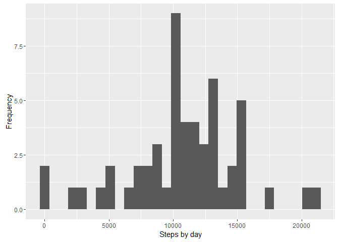
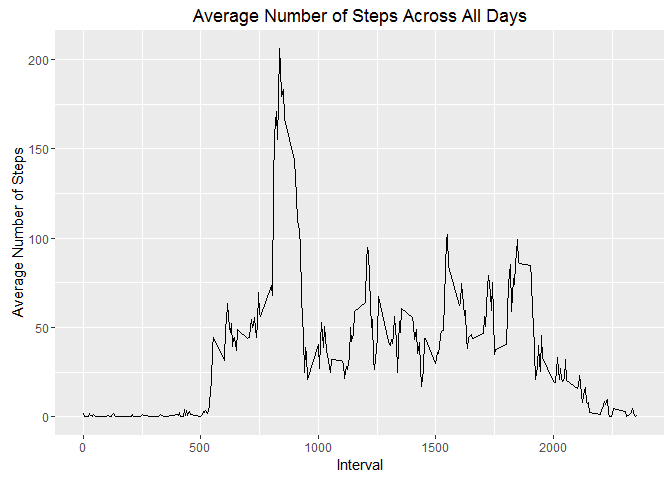
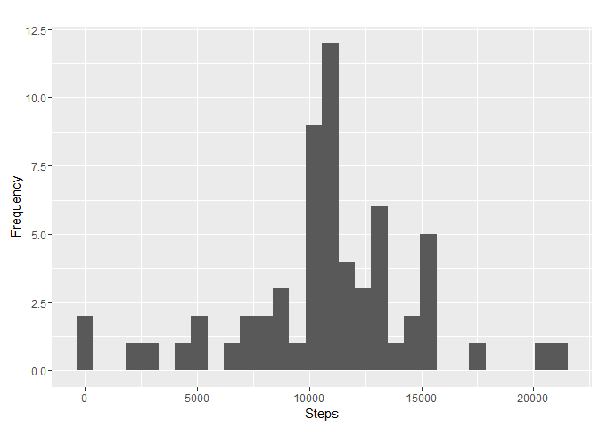
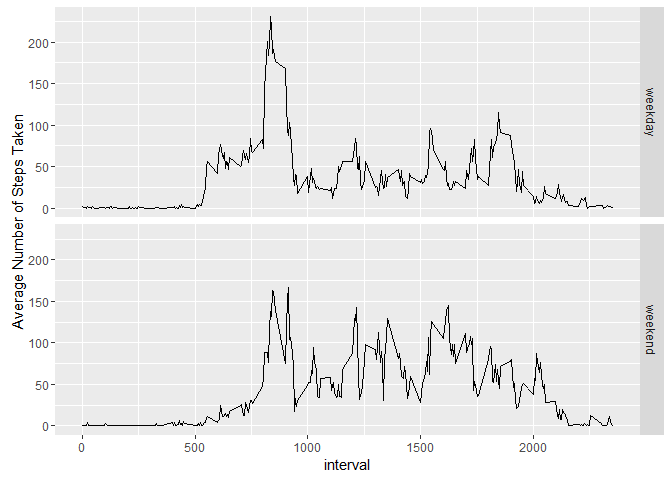

# Reproducible Research: Peer Assessment 1

## Assumption:The activity.csv file has been downloaded and store in the working directory

### Installing required libraries

```r
if (!require("dplyr")) {
  install.packages("dplyr", repos="http://cran.rstudio.com/") 
  library("dplyr")
}
```

```
## Loading required package: dplyr
```

```
## 
## Attaching package: 'dplyr'
```

```
## The following objects are masked from 'package:stats':
## 
##     filter, lag
```

```
## The following objects are masked from 'package:base':
## 
##     intersect, setdiff, setequal, union
```

```r
if (!require("ggplot2")) {
  install.packages("ggplot2")
  library("ggplot2")
}
```

```
## Loading required package: ggplot2
```


## Loading and preprocessing the data

```r
activity.orignal <- read.csv("activity.csv")
activity <-na.omit(activity.orignal)
```


## What is mean total number of steps taken per day?

###1.Calculate the total number of steps taken per day

```r
by_date <- group_by(activity, date)
StepsPerDate <- summarize(by_date, sum(steps))
colnames (StepsPerDate) <- c("date", "steps") 
```

###2.Histogram of the total number of steps taken each day

```r
p <- qplot(steps, data = StepsPerDate)
p <- p + labs(x = "Steps by day")
p <- p + labs(y = "Frequency")
print(p)
```

```
## `stat_bin()` using `bins = 30`. Pick better value with `binwidth`.
```

<!-- -->

###3.Mean and median of the total number of steps taken per day

```r
Daily.Step.Mean  <- mean(StepsPerDate$steps)
Daily.Step.Mean
```

```
## [1] 10766.19
```

```r
Daily.Step.Median  <- median(StepsPerDate$steps)
Daily.Step.Median
```

```
## [1] 10765
```


## What is the average daily activity pattern?
###1. Produce a time series plot (5-minute interval vs. average number of steps)

```r
by_interval <- group_by(activity, interval)
MeanPerInterval <- summarize(by_interval, mean(steps))
colnames (MeanPerInterval) <- c("interval", "steps.mean") 
p <- qplot(interval, steps.mean, data = MeanPerInterval, geom="line")
p <- p + labs(title = "Average Number of Steps Across All Days", x = "Interval", y= "Average Number of Steps")
print(p)
```

<!-- -->

###2.Which 5-minute interval, on average across all the days in the dataset, contains the maximum number of steps?

```r
Interval.Max.StepMean <- MeanPerInterval[which.max(MeanPerInterval$steps.mean),]
Interval.Max.StepMean
```

```
## Source: local data frame [1 x 2]
## 
##   interval steps.mean
##      (int)      (dbl)
## 1      835   206.1698
```


## Imputing missing values

###1.Calculate the total number of missing values in the dataset 

```r
activity.NA <- activity.orignal[is.na(activity.orignal$steps),]
Missing.rows <- NROW(activity.NA)
Missing.rows
```

```
## [1] 2304
```

###2.Devise a strategy for filling in all of the missing values in the dataset. 
Strategy : Replace NA values for steps with the mean of steps for that interval

3.Create a new dataset that is equal to the original dataset but with the missing data filled in.

```r
new.data <- merge(activity.NA, MeanPerInterval, by.x = "interval", by.y ="interval",all.x)
new.data <- subset(new.data, select = c(steps.mean,date,interval))
colnames(new.data) = c("steps","date","interval")
filled.activity <- rbind(activity,new.data)
```

###4.1. Make a histogram of the total number of steps taken each day 


```r
filled.by_date  <- group_by(filled.activity, date)
filled.StepsPerDate <- summarize(filled.by_date, sum(steps))
colnames (filled.StepsPerDate) <- c("date", "steps") 
p <- qplot(steps, data = filled.StepsPerDate)
p <- p + labs(title = "", x = "Steps", y= "Frequency")
print(p)
```

```
## `stat_bin()` using `bins = 30`. Pick better value with `binwidth`.
```

<!-- -->

### 4.2 Calculate and report the mean and median total number of steps taken per day. 


```r
filled.Daily.Step.Mean  <- mean(filled.StepsPerDate$steps)
filled.Daily.Step.Mean
```

```
## [1] 10766.19
```

```r
filled.Daily.Step.Median  <- median(filled.StepsPerDate$steps)
filled.Daily.Step.Median
```

```
## [1] 10766.19
```

### 4.3 Do these values differ from the estimates from the first part of the assignment? What is the impact of imputing missing data on the estimates of the total daily number of steps?

The mean and median for the data set without NA and  the filled dataset do not differ much. The impact/benefit of filling the NA data is minimum


## Are there differences in activity patterns between weekdays and weekends?

###1.Create a new factor variable in the dataset with two levels - "weekday" and "weekend" indicating whether a given date is a weekday or weekend day.


```r
filled.activity$DayType <- as.factor(ifelse(weekdays(as.Date(filled.activity$date) ) %in% c("Saturday", "Sunday"), "weekend", "weekday"))
```

###2.Make a panel plot containing a time series plot (i.e. type = "l") of the 5-minute interval (x-axis) and the average number of steps taken, averaged across all weekday days or weekend days (y-axis). 


```r
filled.by_DayType_interval <- group_by(filled.activity, DayType, interval)
filled.MeanPerInterval <- summarize(filled.by_DayType_interval, mean(steps))
colnames (filled.MeanPerInterval) <- c("DayType", "interval", "steps.mean") 
p <-qplot(interval, steps.mean, data = filled.MeanPerInterval, geom="line",facets = DayType ~ .)
p <- p + labs(x = "interval", y= "Average Number of Steps Taken")
print(p)
```

<!-- -->

